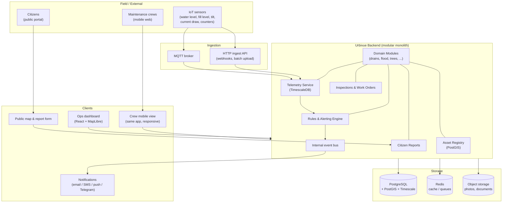

# Urbivue Architecture

## 1. The key design decision: platform + modules, not ten apps

Look at the ten requested features and a pattern emerges — every one of them is some mix of the
same five ingredients:

| Ingredient | Drains | Flood | Trees | Toilets | Lighting | Bins | Pumps | Slopes | Traffic | Accessibility |
|---|---|---|---|---|---|---|---|---|---|---|
| Geolocated physical assets | ✔ | ✔ | ✔ | ✔ | ✔ | ✔ | ✔ | ✔ | ✔ | ✔ |
| Sensor telemetry (time-series) | opt. | ✔ | – | opt. | ✔ | ✔ | ✔ | ✔ | ✔ | – |
| Inspections & maintenance | ✔ | ✔ | ✔ | ✔ | ✔ | ✔ | ✔ | ✔ | ✔ | ✔ |
| Threshold alerts / incidents | ✔ | ✔ | ✔ | – | ✔ | ✔ | ✔ | ✔ | opt. | – |
| Citizen reports | ✔ | ✔ | ✔ | ✔ | ✔ | ✔ | – | ✔ | – | ✔ |

So Urbivue is built as a **horizontal platform** providing those five capabilities generically,
plus **vertical modules** that contribute:

1. **Asset type definitions** — schema for domain attributes (e.g. a tree's species, a pump's
   rated flow), geometry kind (point / line / polygon), and map styling.
2. **Domain logic** — module-specific rules (e.g. flood threshold evaluation, bin route
   generation, slope movement trend analysis).
3. **UI panels** — module dashboard widgets and asset-detail tabs mounted into the shared shell.

This is what makes ten features feasible: after the platform and the first two modules exist,
each additional module is dominated by domain modelling, not infrastructure work.

## 2. System overview



## 3. Tech stack (recommended)

Chosen for a small team, one language end-to-end, and strong geospatial/time-series support:

| Layer | Choice | Rationale |
|---|---|---|
| Language | TypeScript everywhere | One language across API, jobs, and frontend; shared types for asset schemas |
| Backend | NestJS (modular monolith) | Its module system maps 1:1 onto Urbivue's domain modules; DI makes the platform services injectable |
| Database | PostgreSQL 16 + **PostGIS** + **TimescaleDB** | One database covers relational, geospatial, and time-series needs — avoids running three stores |
| ORM | Drizzle (or Prisma) + raw SQL for GIS/TS queries | Typed schema for core entities; PostGIS/Timescale queries stay hand-written |
| Cache / queues | Redis + BullMQ | Alert dispatch, report intake, scheduled jobs (cleaning schedules, route generation) |
| IoT ingestion | MQTT broker (Mosquitto/EMQX) + HTTP ingest endpoint | MQTT for real devices; HTTP for gateways, vendors, CSV backfill, and the sensor simulator |
| Frontend | React + Vite + **MapLibre GL** | Map-first UI; MapLibre is open-source with vector tiles served from PostGIS (via martin/pg_tileserv) |
| Public portal | Same React app, public routes | Citizen map + report form without a second codebase |
| Auth | Session/JWT + RBAC (roles: admin, dispatcher, crew, viewer, public) | Departments map to per-module permissions |
| Deployment | Docker Compose (dev & small-city prod), CI via GitHub Actions | Single-box deployable; can split services later if load demands |

**Deliberate choices to keep scope sane:**

- **Modular monolith, not microservices.** Ten modules × microservices is operational suicide
  for a small team. NestJS modules with an internal event bus give the same boundaries; anything
  can be extracted later since modules only talk via services and events.
- **One database.** PostGIS + TimescaleDB in the same Postgres instance handles everything from
  drain-network geometry to 1-second pump telemetry.
- **Web-first mobile.** Crews use the responsive web app (installable PWA, offline-tolerant
  forms) rather than a native app — revisit only if field feedback demands it.

## 4. Platform services

### 4.1 Asset Registry
The heart of the system. Every physical thing is an `asset` row with a PostGIS geometry, a type,
a status, and a JSONB `attributes` blob validated against the module's asset-type schema
(shared Zod schemas → validated on API and typed in the frontend). Supports: spatial queries
("all drains within this flood zone"), asset hierarchies (pump station → pumps; toilet block →
fixtures), and asset relationships (sensor X monitors drain Y).

### 4.2 Telemetry pipeline
`MQTT / HTTP → validation → readings hypertable → continuous aggregates → rules engine`.
Readings are `(sensor_id, ts, value, quality)`; Timescale continuous aggregates precompute
hourly/daily rollups for dashboards. Device health (battery, last-seen) is derived here too —
a silent water-level sensor during a storm is itself an alert.

### 4.3 Rules & alerting engine
Declarative rules owned by modules: threshold (`water level > 2.5 m for 5 min`), rate-of-change
(`slope tilt Δ > x/24h`), absence (`no heartbeat for 1 h`), and composite (`rainfall high AND
pump station offline`). Firing a rule creates an **incident**, notifies via configured channels,
and can auto-open a work order. All module correlations (flood ↔ pumps ↔ drains ↔ slopes) happen
via events, never direct cross-module calls.

### 4.4 Inspections & work orders
Generic workflow shared by all modules: **inspection templates** (per asset type checklists with
photos and condition scores), **schedules** (recurring: monsoon-season drain cleaning, quarterly
tree risk checks, daily toilet cleaning), and **work orders** (open → assigned → in progress →
done → verified) linkable to any asset, incident, or citizen report.

### 4.5 Citizen reports
Public form: pick location on map (or auto-locate), category, description, photo. Reports are
routed to the owning module by category + nearest asset, deduplicated spatially ("5 reports
within 50 m about a blocked drain → one issue, 5 subscribers"), and reporters get status updates.

## 5. Module contract

Each module lives in `apps/api/src/modules/<name>/` and registers, at startup:

```ts
interface UrbivueModule {
  key: string;                        // 'drainage', 'flood', 'trees', ...
  assetTypes: AssetTypeDefinition[];  // schema, geometry kind, map style, detail tabs
  inspectionTemplates: InspectionTemplate[];
  alertRules: AlertRuleDefinition[];  // default rules, tunable per-city in DB
  reportCategories: ReportCategory[]; // citizen-facing categories it handles
  jobs?: ScheduledJobDefinition[];    // e.g. nightly bin-route generation
  eventHandlers?: EventHandler[];     // reactions to other modules' events
}
```

The frontend mirrors this: each module contributes routes, map layers, and dashboard cards to a
shared shell via a module manifest.

## 6. Repository layout (target)

```
urbivue/
├── apps/
│   ├── api/                 # NestJS backend
│   │   └── src/
│   │       ├── platform/    # asset registry, telemetry, rules, workflow, reports, auth
│   │       └── modules/     # drainage/ flood/ pumps/ slopes/ lighting/ bins/ traffic/ trees/ toilets/ accessibility/
│   └── web/                 # React frontend (ops dashboard + crew view + public portal)
├── packages/
│   ├── shared/              # Zod schemas, types, constants shared api<->web
│   └── simulator/           # sensor simulator for dev/demo (MQTT publisher)
├── infra/
│   └── docker/              # compose files: postgres+extensions, mosquitto, redis, tileserver
└── docs/
```

## 7. Cross-cutting concerns

- **RBAC:** role × module × action. A parks officer edits trees but only views drains.
- **Audit log:** every mutation on assets, rules, and work orders is recorded (public-sector requirement).
- **Offline tolerance:** crew inspection forms queue submissions locally and sync when online.
- **i18n:** UI strings externalized from day one (municipal deployments are rarely English-only).
- **Data import/export:** CSV/GeoJSON importers per asset type (cities have existing inventories
  in spreadsheets); GeoJSON/CSV export everywhere for GIS interop.
- **Sensor simulator:** ships with the repo so every module is demoable without hardware, and
  rules can be integration-tested (simulate a storm: rainfall ↑, drain levels ↑, pump failure).
