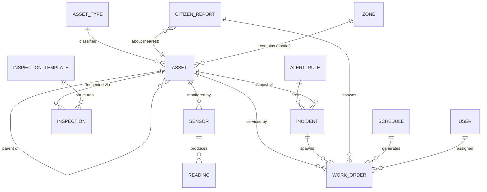

# Urbivue Data Model

One relational model shared by all modules, plus per-module attribute schemas stored as JSONB
and validated by shared Zod schemas. PostGIS supplies geometry types; TimescaleDB supplies the
`readings` hypertable.

## 1. Core entities

### `asset_types`
| Column | Type | Notes |
|---|---|---|
| id | text PK | e.g. `drain_line`, `tree`, `pump`, `waste_bin` |
| module | text | owning module key |
| geometry_kind | enum | `point` \| `line` \| `polygon` |
| attribute_schema | jsonb | JSON-Schema exported from the module's Zod schema |
| style | jsonb | map styling (icon, color ramps by status) |

### `assets`
| Column | Type | Notes |
|---|---|---|
| id | uuid PK | |
| type_id | FK → asset_types | |
| code | text unique | human ref, e.g. `DRN-0142` |
| name | text | |
| geom | geometry(4326) | point/line/polygon per type |
| status | enum | `active`, `needs_attention`, `under_maintenance`, `out_of_service`, `decommissioned` |
| condition_score | int nullable | 1 (failed) – 5 (excellent), set by inspections |
| attributes | jsonb | module-specific, validated against `attribute_schema` |
| parent_id | FK → assets nullable | hierarchies (pump station → pump) |
| installed_at / decommissioned_at | date | lifecycle |
| created_at / updated_at | timestamptz | |

Indexes: GiST on `geom`, GIN on `attributes`, btree on `(type_id, status)`.

### `sensors`
| Column | Type | Notes |
|---|---|---|
| id | uuid PK | |
| asset_id | FK → assets nullable | what it monitors (a standalone rain gauge has none) |
| kind | text | `water_level`, `rainfall`, `fill_level`, `tilt`, `piezometer`, `current`, `flow`, `vehicle_count`, `occupancy`, ... |
| external_id | text | device ID as sent on MQTT/HTTP |
| unit | text | `m`, `mm/h`, `%`, `deg`, `A`, `veh/h`, ... |
| geom | geometry(Point,4326) | |
| config | jsonb | reporting interval, calibration, expected heartbeat |
| last_seen_at | timestamptz | drives device-health alerts |

### `readings` (Timescale hypertable, partitioned by `ts`)
`(sensor_id FK, ts timestamptz, value double precision, quality enum('good','suspect','bad'))`
— continuous aggregates: `readings_1h`, `readings_1d`. Retention policy per sensor kind
(raw 90 days → aggregates kept for years).

### `inspection_templates` / `inspections`
Templates: per asset type, JSON checklist definition (items: boolean / score / number / photo /
note). Inspections: `asset_id`, `template_id`, `inspector_id`, `performed_at`, `responses jsonb`,
`resulting_condition_score`, `photos[]`. Submitting an inspection updates the asset's
`condition_score` and may auto-open a work order below a threshold.

### `schedules`
Recurrence rules (RRULE) that generate inspections or work orders: `target` (asset filter:
type + zone + attribute predicate), `template_id`, `rrule`, `lead_time`. Powers monsoon drain
cleaning, quarterly tree checks, daily toilet cleaning, pump servicing by run-hours
(hours-based schedules use a telemetry counter instead of RRULE).

### `work_orders`
`asset_id?`, `incident_id?`, `citizen_report_id?`, `kind` (`corrective`,`preventive`,`emergency`),
`priority`, `status` (`open → assigned → in_progress → done → verified` / `cancelled`),
`assignee_id`, `crew notes`, `photos[]`, `cost fields`, timestamps for each transition (SLA
reporting).

### `alert_rules`
| Column | Notes |
|---|---|
| module, key | e.g. `flood.level_warning` |
| kind | `threshold`, `rate_of_change`, `absence`, `composite` |
| scope | sensor kind + optional zone/asset filter |
| params | jsonb: operator, value, duration, severity mapping |
| severity | `info`, `warning`, `critical` |
| channels | notification channel keys |
| enabled | per-city tuning without code changes |

### `incidents`
Fired rules or manually raised events: `rule_id?`, `asset_id?`, `zone_id?`, `severity`,
`status` (`open`, `acknowledged`, `resolved`), `opened_at`, `acked_by`, `resolved_at`,
`timeline jsonb` (state changes + notifications sent). De-duplication: a firing rule attaches
to an existing open incident for the same (rule, asset) instead of creating a new one.

### `citizen_reports`
`category`, `description`, `photos[]`, `geom`, `reporter_contact?`, `status`
(`new → triaged → in_progress → resolved → closed`), `matched_asset_id?`,
`duplicate_of_id?` (spatial+category dedup), `module` (routing). Public read view exposes
status without reporter identity.

### `zones`
Named polygons: flood zones, wards, collection routes, watershed catchments. Used for rule
scoping, dashboards ("Ward 3 assets"), and routing citizen reports to departments.

### `users`, `roles`, `permissions`, `audit_log`
RBAC as role × module × action. `audit_log` records every mutation (entity, before/after, actor, ts).

## 2. Per-module attribute schemas (JSONB `assets.attributes`)

Representative fields — full schemas live in `packages/shared` as Zod definitions.

| Asset type | Module | Geometry | Key attributes |
|---|---|---|---|
| `drain_line` | drainage | line | shape (U/box/pipe), width/depth (m), material, upstream/downstream node ids, capacity class |
| `drain_node` | drainage | point | kind (inlet, manhole, outfall, culvert), invert level |
| `flood_zone` | flood | polygon | risk class, basis (historical/model), evac notes |
| `pump` | pumps | point | rated flow (L/s), head (m), power (kW), drive type, auto-start level |
| `pump_station` | pumps | point/polygon | pumps (children), sump capacity, power feed, backup generator |
| `slope` | slopes | polygon | height, angle, class/risk ranking, geology, drainage provisions, last geotech report |
| `light_pole` | lighting | point | pole height, luminaire type (LED/HPS), wattage, circuit id, smart-node vendor |
| `waste_bin` | bins | point | capacity (L), stream (general/recycle/organic), bin type, collection route id |
| `traffic_counter` | traffic | point | technology (loop/radar/camera), lanes covered, direction(s), road name |
| `tree` | trees | point | species, height, DBH (cm), canopy radius, planted year, health rating, risk rating |
| `toilet_facility` | toilets | point | fixtures (M/F/accessible counts), opening hours, water/power meters, operator |
| `accessible_feature` | accessibility | point/line | feature kind (ramp, tactile path, accessible parking, lift), standard/compliance status, slope %, width |

## 3. Design notes

- **JSONB + schema registry over per-module tables:** new asset types require no migrations;
  spatial and status queries (the hot paths) use typed columns; attribute queries use GIN.
  A module may still add real tables when relational integrity matters (e.g. `traffic_counts`
  aggregates, `bin_collections`).
- **Everything time-series goes to `readings`:** including derived series (pump run-hours,
  bin fill %, toilet visitor counts) — one pipeline, one rules engine, one chart component.
- **Geometry SRID 4326** stored, transformed as needed for distance calcs (use geography type
  for metric queries).
- **Soft asset lifecycle:** assets are never hard-deleted; `decommissioned` keeps history and
  audit trails intact.
