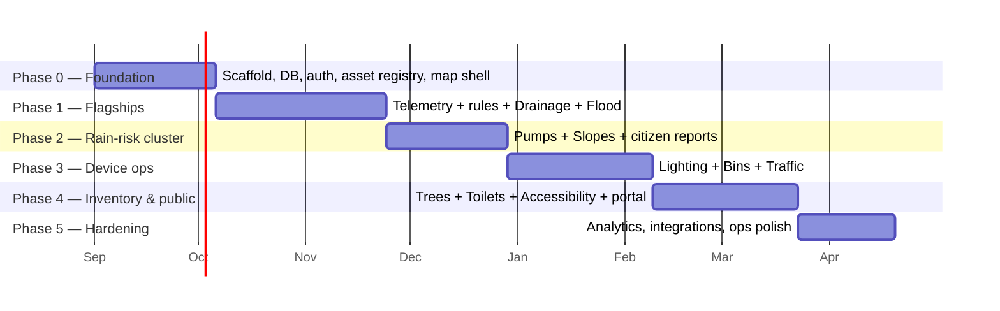

# Urbivue Implementation Roadmap

Delivery is ordered so that (1) the platform is proven by the two flagship modules first,
(2) each phase reuses what the previous phase built, and (3) something demoable exists at the
end of every phase. Estimates assume a small team (1–3 developers) and are in working weeks.

---

## Phase 0 — Platform foundation (~5 weeks)

The unglamorous phase that makes the other five cheap.

1. **Repo scaffold:** pnpm monorepo (`apps/api`, `apps/web`, `packages/shared`,
   `packages/simulator`), TypeScript strict, ESLint/Prettier, Vitest, GitHub Actions CI
   (lint + typecheck + tests on PR).
2. **Infra:** Docker Compose — Postgres 16 + PostGIS + TimescaleDB, Redis, Mosquitto,
   pg_tileserv/martin; migration tooling; seed script.
3. **Auth & RBAC:** users, roles (admin / dispatcher / crew / viewer / public), per-module
   permissions, audit log middleware.
4. **Asset registry:** asset types + assets CRUD with JSONB attribute validation (Zod schemas
   in `packages/shared`), spatial queries, hierarchy, CSV/GeoJSON import + export.
5. **Web shell:** React + MapLibre map with layer toggles per asset type, asset detail drawer,
   module manifest/routing system, responsive layout (crew mobile usable from day one).

**Exit criteria:** a generic asset type can be defined, imported from GeoJSON, browsed on the
map, and edited — with roles enforced and CI green. *No domain modules yet.*

## Phase 1 — Drain Management + Flood Monitoring (~7 weeks)

The two ✓ features, plus the platform pieces they force into existence.

1. **Telemetry pipeline:** MQTT + HTTP ingestion → `readings` hypertable, sensor registry,
   device-health tracking, continuous aggregates, chart component in web.
2. **Sensor simulator:** scripted scenarios (dry day, storm, sensor failure) publishing to
   MQTT — used in dev, demos, and integration tests thereafter.
3. **Rules & alerting engine:** threshold / rate / absence / composite rules → incidents →
   notification channels (email + Telegram/webhook first, SMS adapter later); incident
   board UI (acknowledge/resolve).
4. **Inspections & work orders (platform):** templates, mobile inspection form with photos +
   offline queue, work-order lifecycle, recurring schedules.
5. **Drainage module** and **Flood module** per [`MODULES.md`](MODULES.md) — asset types,
   templates, default rules, dashboards, cleaning-priority logic, zone status rollup.

**Exit criteria:** run the simulator's storm scenario → stations go amber/red on the live map,
incidents fire and notify, duty officer acknowledges; a drain inspection at 80 % blockage
auto-opens a work order that a crew closes from a phone.

## Phase 2 — Water Pumps + Slope Monitoring (~5 weeks)

Reuses the entire Phase 1 telemetry/rules stack; adds the cross-module event patterns.

1. Pumps module: station/pump hierarchy, run telemetry, run-hours-based service schedules,
   readiness board, flood-event interlock rules.
2. Slopes module: registry with risk ranking, tilt/piezometer pipelines, rate-of-change rules,
   rain-correlation composite rules, geotech inspection templates.
3. **Citizen reports (platform):** public report form, spatial dedup, module routing, triage
   queue, reporter status notifications — wired into drainage/flood/slopes categories.

**Exit criteria:** simulated storm now also exercises pump-failure and slope-watch composite
rules; a citizen-reported blocked drain lands in the drainage triage queue deduplicated.

## Phase 3 — Street Lighting + Waste Bins + Traffic Counters (~6 weeks)

Three modules that stress device fleets at scale (thousands of assets) rather than new platform
concepts.

1. Lighting: circuit modelling, outage/day-burner rules, circuit-level incident rollup,
   no-sensor fallback flows, energy dashboard.
2. Bins: fill telemetry + estimated-fill model, nightly route-generation job, collection-event
   logging, overflow flows.
3. Traffic: count ingestion at volume (load-test the pipeline), AADT/profile analytics,
   before/after comparison view, public read-only data API + exports.
4. Platform work surfaced by scale: map clustering/vector-tile performance for 10k+ points,
   bulk import ergonomics, list virtualization.

**Exit criteria:** 10k simulated poles + 2k bins + 50 counters perform smoothly on the map;
a nightly route list generates; a counter's monthly CSV export validates against ingested totals.

## Phase 4 — Trees + Public Toilets + Accessible Facilities + public portal (~6 weeks)

Inventory/inspection-centric modules and the citizen-facing surface.

1. Trees: species library, risk-based inspection scheduling, post-storm campaign trigger,
   canopy/ward stats.
2. Toilets: cleaning check-ins with SLA tracking, ratings, leak-detection rules, contractor
   quality score.
3. Accessibility: audit templates, compliance backlog, coverage scoring.
4. **Public portal (platform):** public map (flood status, toilets, accessibility layer),
   report forms for all public categories, report status tracking, advisory banners.

**Exit criteria:** a citizen can find the nearest open accessible toilet, see when it was last
cleaned, rate it, and report a blocked ramp — and the right department sees each item.

## Phase 5 — Hardening & city-readiness (~4 weeks)

- Cross-module analytics: ward scorecards, SLA/response-time reports, seasonal comparisons,
  scheduled PDF/email digests.
- Integration adapters: sensor-vendor webhook mappers, open-data (GTFS-style) exports,
  optional SWMM/HEC-RAS flood-model import.
- Ops: backup/restore runbook, Timescale retention/compression policies, monitoring
  (healthchecks, error tracking), load and security review, deployment guide.
- i18n pass and accessibility (WCAG) audit of the UI itself.

---

## Sequencing rationale

- **Drains + Flood first** — they are the stated core, they force the hardest platform pieces
  (telemetry, rules, workflows) to exist early, and they demo dramatically (storm simulation).
- **Pumps + Slopes second** — same sensor stack, and together with Phase 1 they complete the
  rain-risk cluster where cross-module events pay off most.
- **Lighting + Bins + Traffic third** — high asset counts; done after the platform is stable so
  performance work lands on proven foundations.
- **Trees + Toilets + Accessibility last** — lowest technical risk (little/no telemetry), and
  they benefit from the citizen-report and scheduling machinery already being mature.

## Risks & mitigations

| Risk | Mitigation |
|---|---|
| Sensor hardware unavailable during development | Simulator is a first-class Phase 1 deliverable; every module specifies a zero-sensor fallback |
| Ten modules → scope creep | Module specs list explicit exclusions (e.g. no hydraulic modelling, heuristic routing before VRP); platform-first design caps per-module cost |
| JSONB attributes drift from schemas | Single source of truth in `packages/shared` Zod; API validates on write; CI type-checks web against the same types |
| Map performance at 10k+ assets | Vector tiles from PostGIS + clustering, addressed explicitly in Phase 3 |
| Municipal data quality (imports) | Importers with dry-run validation reports; `suspect` quality flags rather than silent rejects |
| Small team burnout across 10 domains | Phases end with demoable, shippable increments; a city can go live after any phase ≥ 1 |
